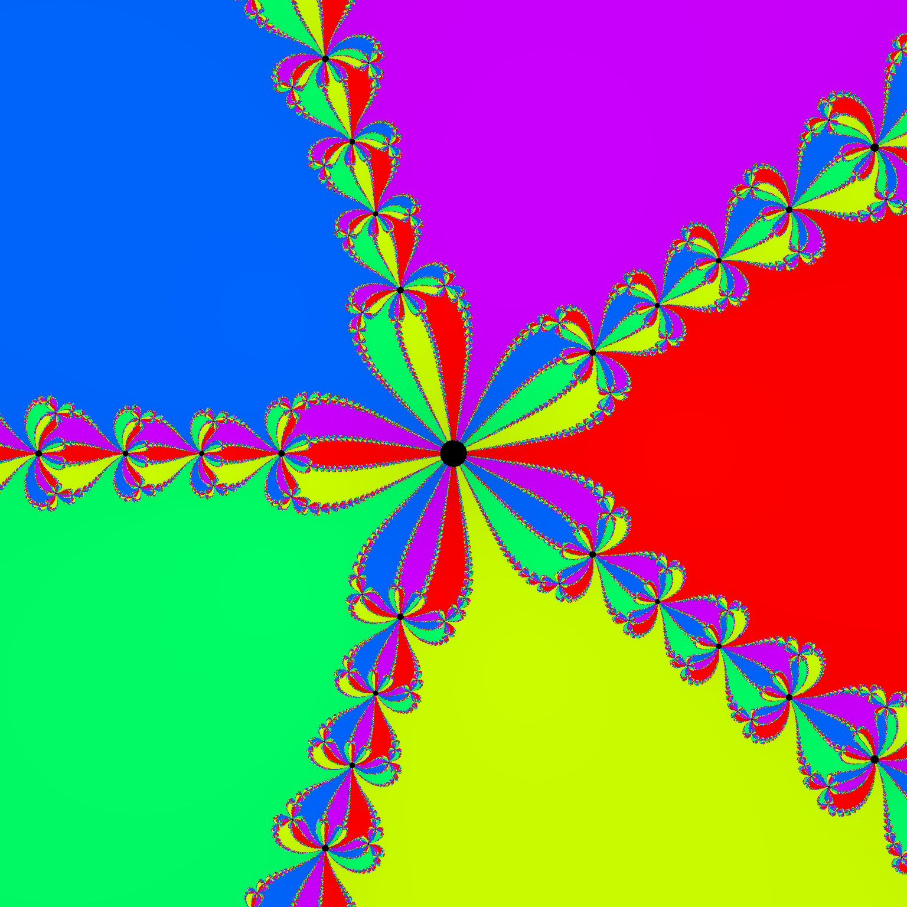
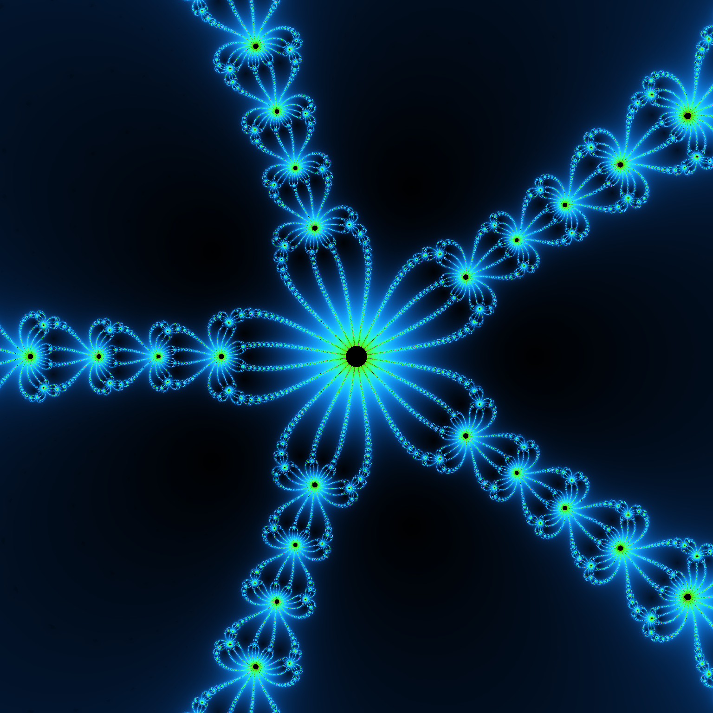
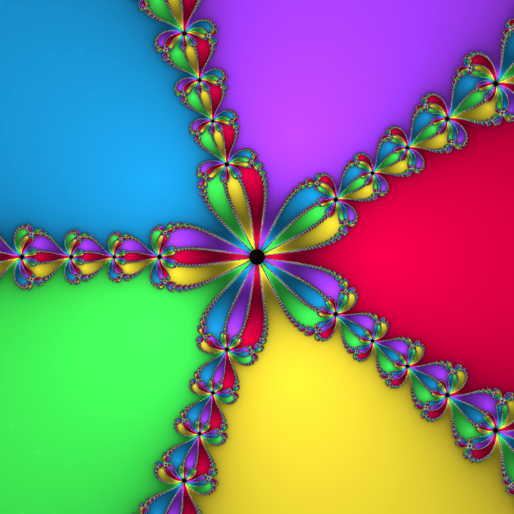
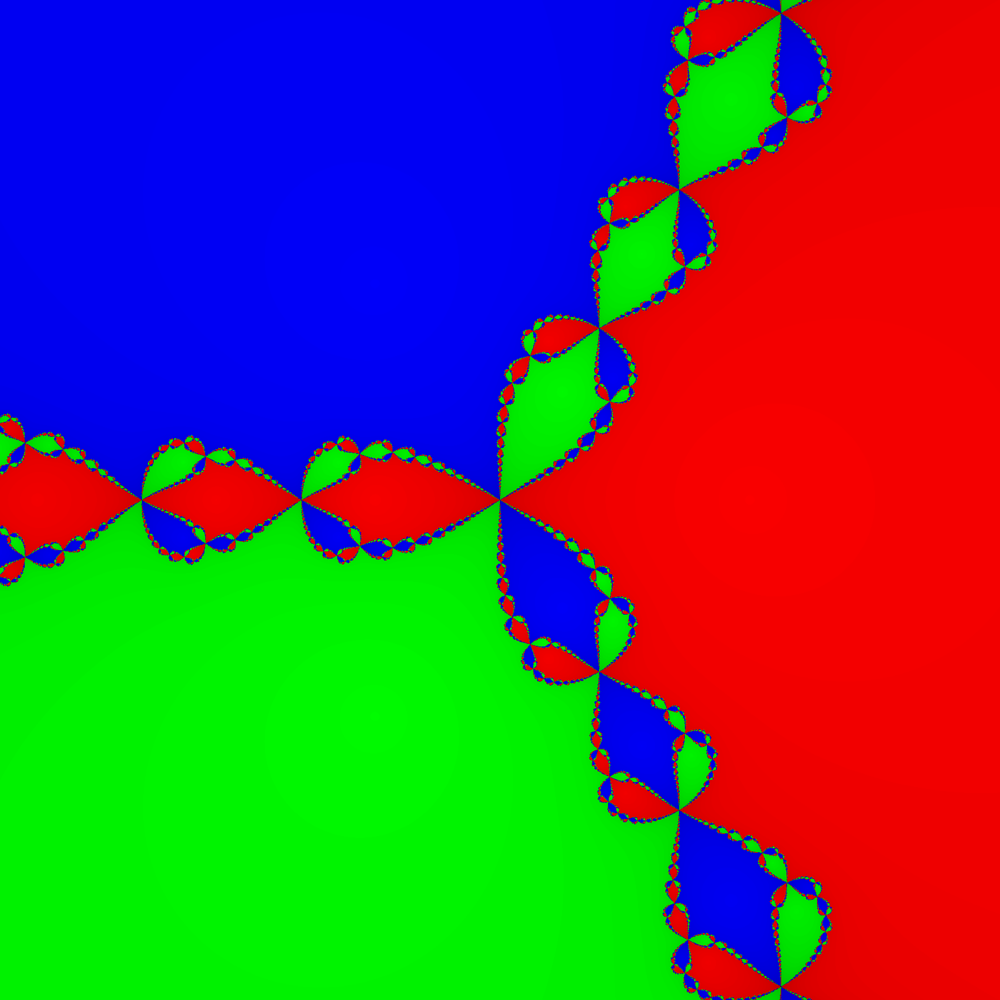
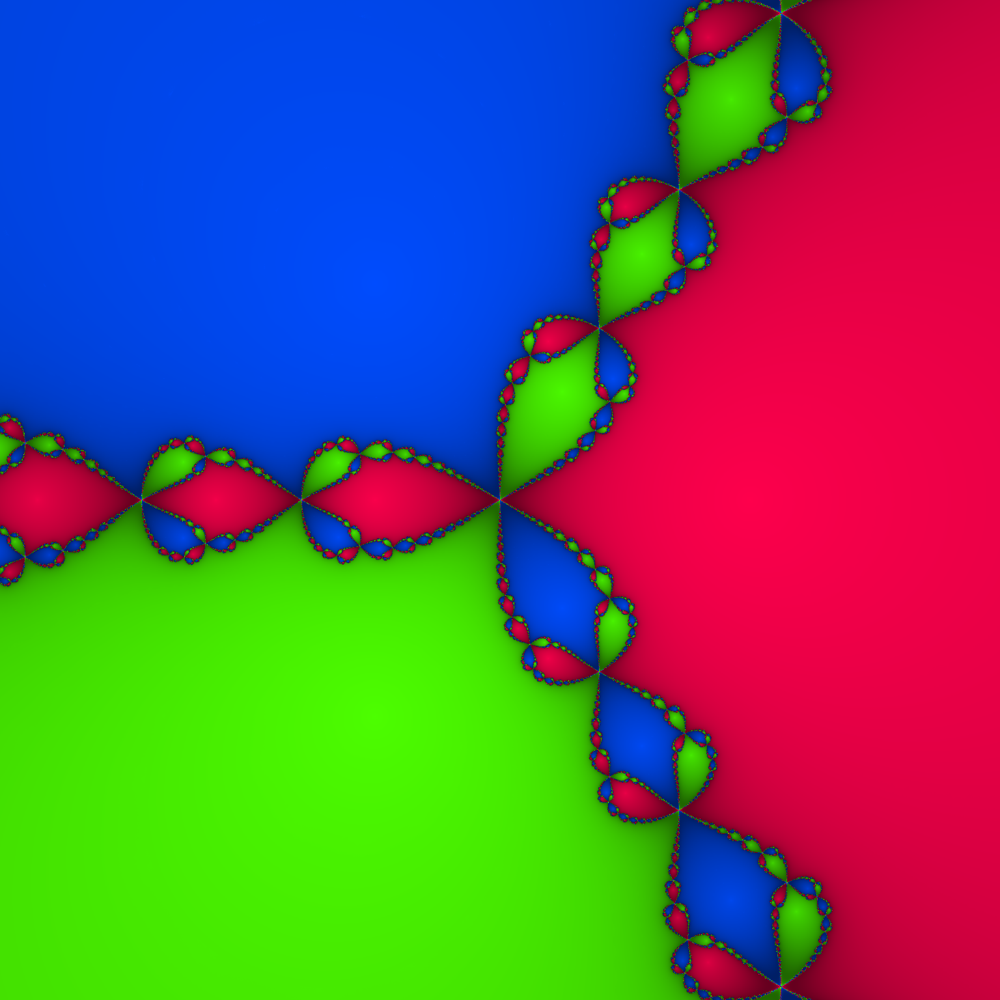

# nfract

[](https://github.com/Horizon-NTH/nfract/releases)
[](https://en.wikipedia.org/wiki/C%2B%2B20)
[](LICENSE)
[](https://github.com/Horizon-NTH/nfract/actions/workflows/ci.yml)

## Introduction

nfract is a fast Newton fractal renderer that mixes modern C++20 with [ISPC](https://ispc.github.io/) kernels to turn
complex analytic roots into detailed PNGs. The renderer lets you tune the polynomial degree, viewport, convergence
tolerance, iteration budget, and color palette directly from the command line.


## Features

- **Dual backends**: Vectorized ISPC kernel by default, with a portable scalar CPU fallback (`-DRUN_ON_CPU=ON`).
- **Flexible CLI**: Control resolution, complex plane bounds, iteration depth, tolerance, output path, and palette.
- **Color palettes**: Classic root-based hues, neon oscillations, and jewelry-style highlights.
- **Benchmark helpers**: `scripts/render_compare.sh` rebuilds both backends, renders every palette, and prints timings.

## Gallery

| Classic (n = 5)                                  | Neon (n = 5)                               | Jewelry (n = 5)                                  |
|--------------------------------------------------|--------------------------------------------|--------------------------------------------------|
|  |  |  |

| Classic (n = 3)                                  | Neon (n = 3)                               | Jewelry (n = 3)                                  |
|--------------------------------------------------|--------------------------------------------|--------------------------------------------------|
|  |  |  |

> [!TIP]  
> Refresh the gallery at any degree (default `5`) with `scripts/render_compare.sh -o docs/gallery [-n DEGREE]` and
> compare ISPC vs. CPU performance.

## Installation

### Prerequisites

- CMake **3.21+**
- A C++20 compiler (Clang 14+, GCC 11+, MSVC 2022)
- [ISPC](https://ispc.github.io/downloads.html) if you want the vectorized backend (set `-DRUN_ON_CPU=ON` otherwise)
- Ninja or Makefiles (any generator supported by your toolchain)

> [!WARNING]  
> Visual Studio generators do **not** support the ISPC build. Use the MSVC compiler through a Ninja/Makefiles generator,
> or configure with `-DRUN_ON_CPU=ON` if you must stick to the VS generator.

> [!NOTE]  
> nfract targets macOS, Linux, and Windows. GitHub Actions currently exercise builds on all these platforms.
> But the development was made on macOS, so this platform gets the most coverage.

### Get Source

```bash
git clone https://github.com/Horizon-NTH/nfract.git
cd nfract
```

### Configure & Build

```bash
cmake -S . -B build -DCMAKE_BUILD_TYPE=Release \
      [-DRUN_ON_CPU=ON] \
      [-DENABLE_TESTS=ON]
cmake --build build --parallel
```

### Install (optional)

```bash
cmake --install build
```

## Rendering

Render a 4K neon image of the polynomial `z^7 - 1`:

```bash
build/nfract --degree 7 --width 3840 --height 2160 --neon \
             --max-iter 500 --tol 1e-3 \
             --out neon-7.png
```

> [!TIP]  
> Pass `--help` or `--help-all` to inspect every flag. `-v|--version` prints the build version and exits.

### CLI Reference

| Option                                   | Description                                                       |
|------------------------------------------|-------------------------------------------------------------------|
| `-n, --degree <int>`                     | Degree `n` in `z^n - 1 = 0` (default `5`, range `2-64`).          |
| `--width <int>` / `--height <int>`       | Output resolution in pixels (defaults `1920 x 1080`).             |
| `--xmin --xmax --ymin --ymax <float>`    | Complex plane bounds (defaults `[-2, 2]` on both axes).           |
| `--max-iter <int>`                       | Maximum Newton iterations per pixel (default `100`).              |
| `--tol <float>`                          | Convergence tolerance on `\|f(z)\|` (default `1e-3`, min `1e-6`). |
| `-o, --out <path>`                       | Output PNG path (default `nfract.png`).                           |
| `--neon` / `--jewelry`                   | Select the neon or jewelry palette (classic is the default).      |
| `--help`, `--help-all`, `-v`, --version` | Show help or version info and exit.                               |

### Color Modes

- **Classic**: Hue encodes the root index, value darkens with slower convergence.
- **Neon**: Independent cosine waves per channel for glowing gradients driven by smooth iteration counts.
- **Jewelry**: Base hue per root plus complementary highlights for gem-like flashes.

## Testing

```bash
cmake -S . -B build -DENABLE_TESTS=ON
cmake --build build
ctest --test-dir build/tests/
```

## Dependencies

- **[CLI11](deps/CLI11.hpp)** for argument parsing.
- **[stb_image_write](deps/stb_image_write.h)** for saving RGBA PNGs.
- **[ISPC](src/kernel/Newton.ispc)** for data-parallel kernels (optional; CPU fallback provided).
- **[GoogleTest](https://github.com/google/googletest)** for the optional unit tests.

## License

This project is licensed under the MIT License – see [LICENSE](LICENSE) for details.
